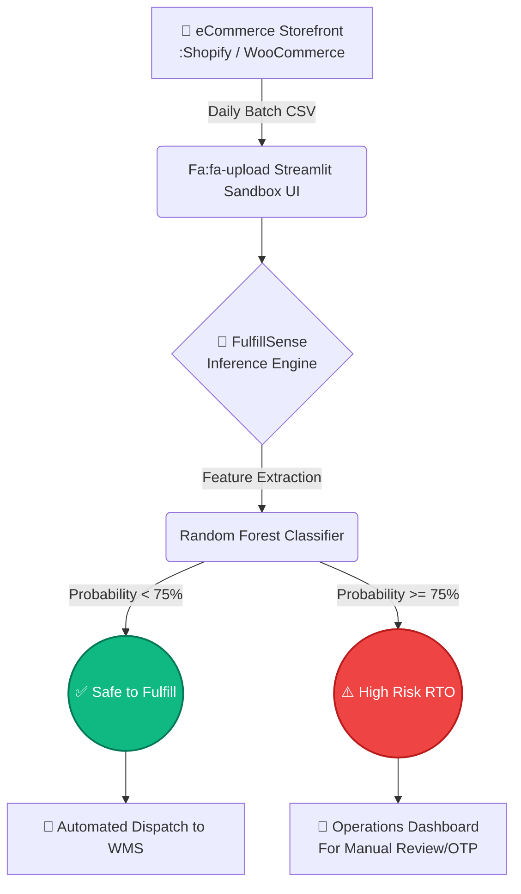

<div align="center">
  <div style="background-color: #818cf8; padding: 20px; border-radius: 10px; display: inline-block;">
    <h1 style="color: white; margin: 0;">📦 FulfillSense</h1>
  </div>
  <p><b>Next-Gen Predictive Risk Intelligence API for Quick-Commerce Logistics</b></p>
  
  [](https://python.org)
  [](https://scikit-learn.org)
  [](https://streamlit.io/)
  [](https://tailwindcss.com/)
</div>

---

## 🚨 The Business Problem
Return-to-Origin (RTO) is the silent killer of eCommerce margins, particularly in South Asian markets where Cash on Delivery (COD) dominates. When a COD order is shipped but rejected by the customer upon delivery, the merchant absorbs **100% of the forward and reverse logistics costs** with zero revenue.

Primitive rule-based fraud detection engines are too aggressive (blocking genuine buyers) or too passive (letting fraud through). 

## 💡 The FulfillSense Solution
**FulfillSense** is a machine learning pipeline that intercepts high-risk COD orders *before* they enter your supply chain. Rather than relying on simple "If-Then" rules, FulfillSense uses a **Random Forest Classifier** to detect multivariate, non-linear correlations in consumer behavior (e.g., *a high-cart-value guest checkout placed at 3 AM via COD*), intercepting the order for manual validation and instantly protecting supply chain margins.

## 🏗️ Technical Architecture



## 💻 Tech Stack
- **Machine Learning Core**: `scikit-learn`, `pandas`, `numpy`
- **Model Serialization**: `joblib`
- **SaaS Backend & Pipeline UI**: `streamlit`
- **Data Visualization**: `plotly`
- **Marketing Front-End**: `HTML5`, `TailwindCSS` (Zero-image CSS Keyframe Animations)

## 🚀 Getting Started

Want to run the machine learning engine locally? It takes less than 60 seconds.

### 1. Clone the repository
```bash
git clone https://github.com/abhinavthakurr/fulfill-sense.git
cd fulfill-sense
```

### 2. Install dependencies
```bash
pip install -r requirements.txt
```
*(If `requirements.txt` is not present, manually install: `pip install pandas numpy scikit-learn streamlit plotly joblib`)*

### 3. Generate Data & Train the Model (Optional)
If you want to train the Random Forest model from scratch:
```bash
# 1. Generate 5,000 synthetic Indian eCommerce records
python generate_real_data.py

# 2. Train the Random Forest Classifier -> outputs 'rto_model.pkl'
python train_model.py
```

### 4. Boot up the Streamlit SaaS Dashboard
```bash
streamlit run app.py
```
*Navigate to `http://localhost:8501` to view your local instance.*

---

## 👨‍💻 Author
Built by **Abhinav Thakur**. 
Demonstrating end-to-end full-stack capabilities, from raw data synthesis and machine learning serialization to highly polished B2B SaaS front-end design.
